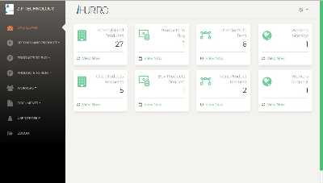
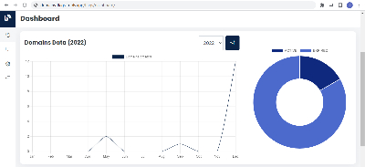
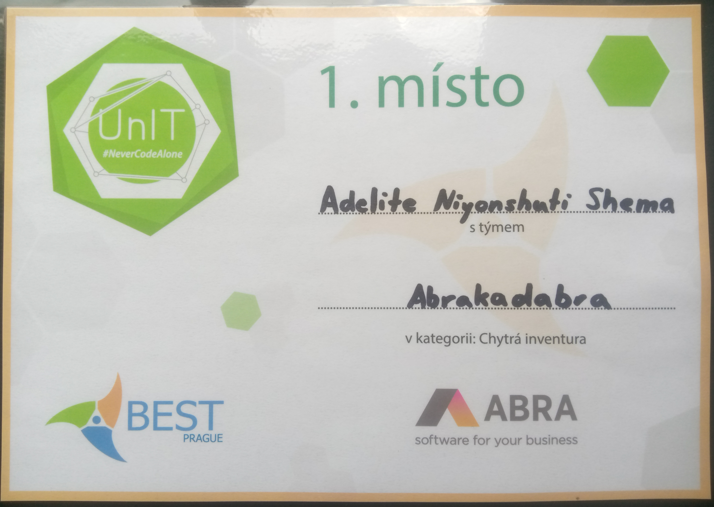
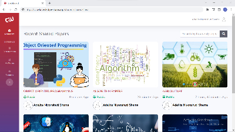

### Hi there 👋

My name is Adelite and I’m a software developer. I work mostly with Python/Django and Javascript/React to create web based applications. I’ve demonstrated the ability to work alone efficiently with minimal supervision, as well in a group setting in order to achieve deliverable results. 

💻 **Tech stack**: Python, Django, DRF, MySQL, Javascript, React.

💪 **Things I like**: Web development, Automation.

### My Projects

<table border="0">

<tr><td>

<a href="https://www.loom.com/share/e653dfc90ab242e981a8670cd7a561d8?sid=eeba1de0-2324-418a-9bdb-7a233fd095b1"><b>IHURIRO</b></a> - 
I've developed this project from the ground up. It is an all in one platform to connect people losts and found important documents, Buying & Sellig secondhand products.
</td></tr>

<tr><td>

<a href="https://github.com/codewithadelite/domains"><b>DOMAINS TOOL</b></a> - 
I've developed this tool which allows to manage domain names.
</td></tr>

<tr><td>

<a href="https://unit.bestprague.cz/"><b>UNIT</b></a> - 
Our team won the first place out of 5 teams on <a href="https://unit.bestprague.cz/"><b>UNIT</b></a> Challenge. The project was smart Inventory web application for <a href="https://abra.eu/"><b>ABRA</b></a>.
</td></tr>

<tr><td>

<a href="https://github.com/codewithadelite/czu-knowledge-share/tree/knowledge-share-app/CZU-KNOWLEDGE-SHARE-PROJECT"><b>CZU KNOWLEDGE SHARE</b></a> - 
During my time at česká zemědělská univerzita, I've developed this web application which allows students of PEF Faculty share their self-study papers so that other students can use those papers as well.
</td></tr>

</table>
